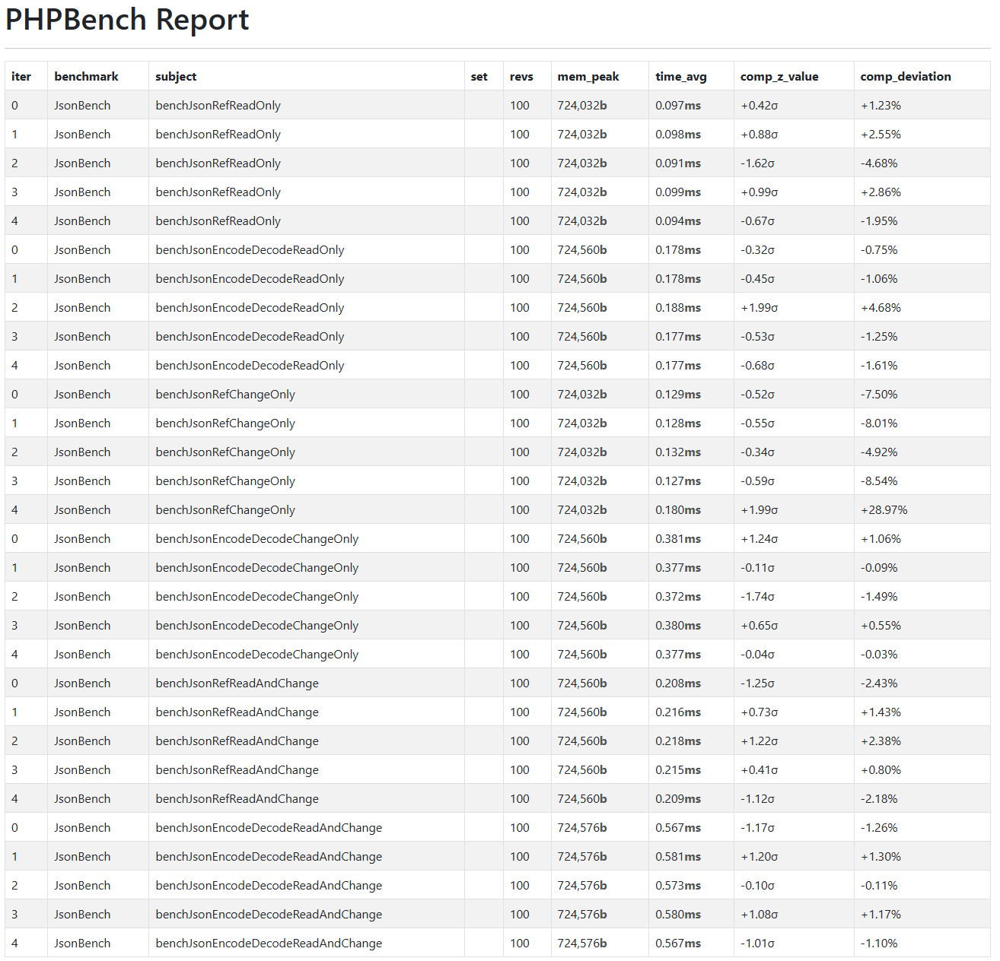
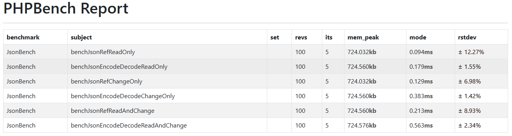

# PHP Extension JSON REF


> **JsonRef** - is a PHP extension written in C that allows you to read and modify JSON strings directly without converting them to PHP arrays or objects.
> This is achieved by parsing the path and searching for the desired node in the string, and then safely changing the values on the fly.

---

## It is important to understand

### Where it helps (see benchmarks):

- You often need to read random fields from a large JSON
  API, where 90% of operations are data reads
- Work with configurations, templates, cached structures
- Partial data update (patch operations)
- High-load systems
- Working with large JSON documents (10+ MB)
- Counters, increments, complex calculations based on current values
- Transactional operations with JSON (read → checked → changed)
- The real world: 90% of the business logic is exactly like that

---

## Install

### Source code build

```bash
git clone https://github.com/Pashgunt/php_jsonref.git
cd php_jsonref
make install
```

Add to `php.ini`:
```ini
extension=jsonref.so
```

---

## Structure of functions

1. `json_get(string $json, string $pathFieldInJson): mixed`
    - `$json` - the structure of the json file as a string
    - `$pathFieldInJson` - path to the property whose value you need to get
2. `json_set(string $json, string $pathFieldInJson, mixed $value): void`
    - `$json` - the structure of the json file as a string
    - `$pathFieldInJson` - path to the property whose value you need to change
    - `$value` - a new value that needs to be set

---

## Benchmark




### Performance comparison with JSON: Reference vs Decode/Encode

### Description of the tests

1. **benchJsonRefReadOnly**
   - **Action:** only reading one field via `json_get` along the way.
   - **Meaning:** checks the speed of reading a single value from JSON without decoding the entire object.

2. **benchJsonEncodeDecodeReadOnly**
   - **Action:** complete decoding into an array and reading the field.
   - **Meaning:** shows the overhead of the full `json_decode`.

3. **benchJsonRefChangeOnly**
   - **Action:** only changing one field via 'json_set'.
   - **Meaning:** checks the rate of JSON point change without reassembling the entire object.

4. **benchJsonEncodeDecodeChangeOnly**
   - **Action:** Decoding, field modification, reverse encoding.
   - **Meaning:** Measures the cost of the full decode → modify → encode cycle.

5. **benchJsonRefReadAndChange**
   - **Action:** Reading and changing fields through reference functions.
   - **Meaning:** checks the "read → changed" scenario without unnecessary operations.

6. **benchJsonEncodeDecodeReadAndChange**
    - **Action:** Full cycle: decoding, reading, changing, encoding.

### Results and recommendations

### 1. Read-only (`benchJsonRefReadOnly` vs `benchJsonEncodeDecodeReadOnly`)

Reference:  0.077-0.080 ms <br>
Decode:     0.150-0.159 ms

**When to use the Reference:**
- You often need to read random fields from a large JSON
  API, where 90% of operations are data reads
- Work with configurations, templates, cached structures

**When to use Decode/Encode:**
- Almost never for pure read — Reference it is always faster

### 2. Change only (`benchJsonRefChangeOnly` vs `benchJsonEncodeDecodeChangeOnly`)

Reference:  0.108-0.119 ms <br>
Decode:     0.319-0.324 ms

**When to use the Reference:**
- Partial data update (patch operations)
- High-load systems
- Working with large JSON documents (10+ MB)

**When to use Decode/Encode:**
- If you need multiple changes to different fields at a time
- If the JSON needs to be completely rebuilt anyway (different structure)
- If the change affects >30% of the data (overhead depreciation)

### 3. Read + Modify (`benchJsonRefReadAndChange` vs `benchJsonEncodeDecodeReadAndChange`)

Reference:  0.175-0.184 ms <br>
Decode:     0.481-0.497 ms

**When to use the Reference:**
- Counters, increments, complex calculations based on current values
- Transactional operations with JSON (read → checked → changed)
- The real world: 90% of the business logic is exactly like that

**When to use Decode/Encode:**
- If the logic requires access to multiple related fields
- If you need to validate the integrity of the entire document
- For complex queries (filtering, sorting, grouping)

### Summary table of average time values (ms)

| Test | Reference approach (`json_get`/`set`) | Decode/Encode approach | Difference | The winner |
|------|-------------------------------------|----------------------|---------|-----------|
| Read-only | 0.0786 ms | 0.1538 ms | ~2x faster | Reference |
| Change only | 0.1112 ms | 0.3204 ms | ~3x faster | Reference |
| Read + Modify | 0.1812 ms | 0.4886 ms | ~2.7x faster | Reference |
